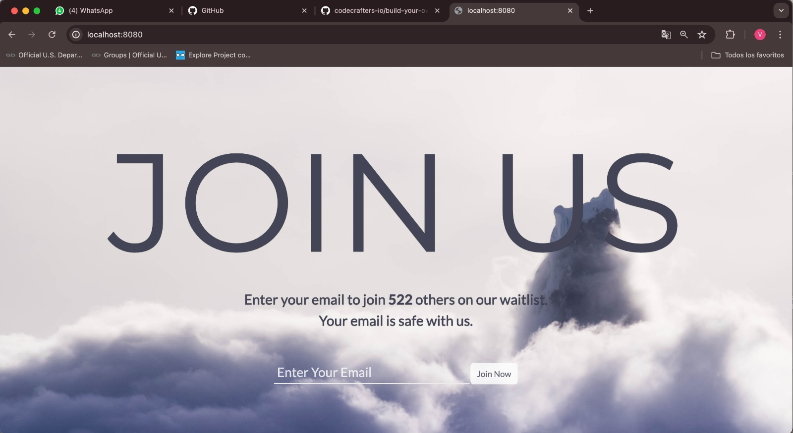
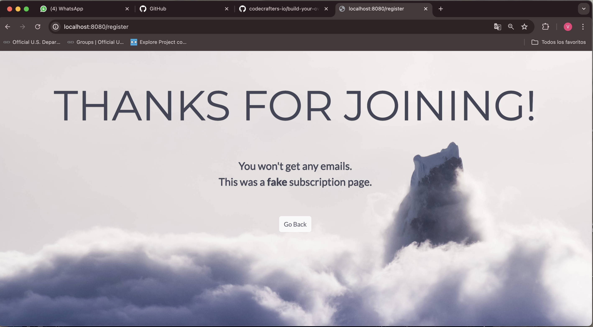

# Subscription-Page
Simple fake subscription page using **SQL** for the backend database. 

Used beginner knowledge of **JavaScript** and **CSS** through **Node.js**

## View

*Home Page*



*Subscribed page*



## Instructions

To run the project locally:

1. Create a database in mysql called `projectNode` and edit the connection in the `app.js` file, by writing your own password.

  ```
     var connection = mysql.createConnection({
     
        host: 'localhost',
        user: 'root',
        password: 'xxxxx',
        database: 'projectNode'
  
      });

  ```
     
   
2. Locate yourself in the `project` package
3. Run the following command from the terminal
  
   ```
   node app.js
   
   ``` 
4. In your prefered browser, write

    ```
   localhost:8080
   
   ``` 
     
